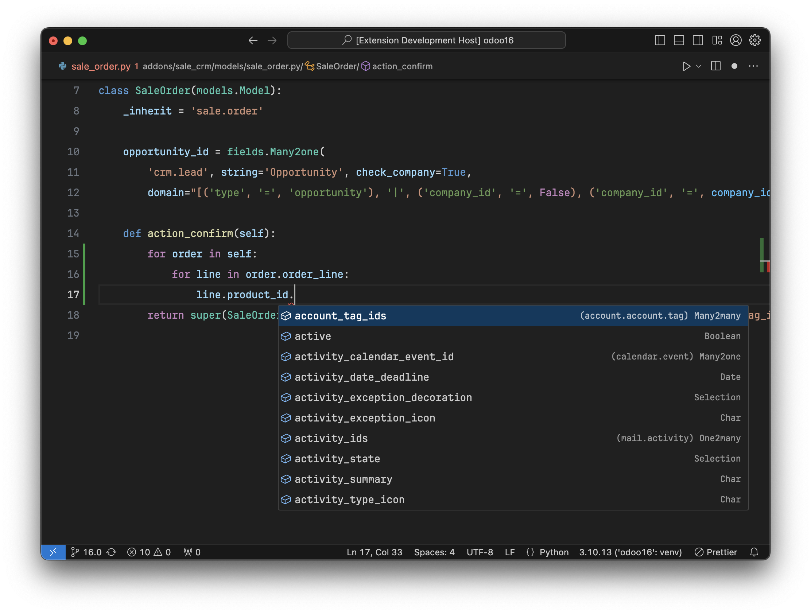
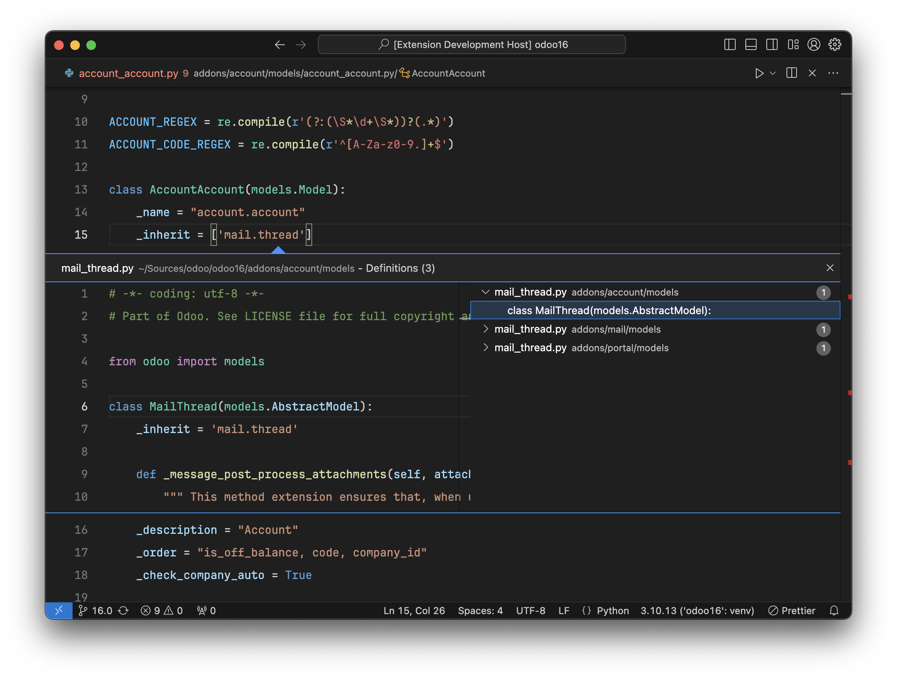

# Odoo Framework Integration for Visual Studio Code

Boost your productivity and make your life easier as an Odoo developer

[Homepage](https://odoo-ide.com) | [Blog](https://odoo-ide.com/blog) | [Issue Tracker](https://github.com/odoo-ide/vscode-odoo/issues)

This extension is in the early stages of development. A lot of features are missing compared to the [PyCharm plugin for Odoo](https://plugins.jetbrains.com/plugin/13499-odoo).

## Features
- Resolve `odoo.addons.*` imports for built-in addons and custom addons.
- Understand model inheritance mechanisms.
- Type inference for:
  - `self` in model methods.
  - Relational fields.
- Code completion, navigation and validation for:
  - Model name:
    - `_inherit`, `_inherits` (model class attributes)
    - `comodel` (relational field definitions)
    - `env[...]`
  - Module name:
    - `depends`, `auto_install` in manifest
- Suppress the `Expression value is unused` warning in manifest.

## Installation
1. Install the Odoo extension from [VSCode Marketplace](https://marketplace.visualstudio.com/items?itemName=trinhanhngoc.vscode-odoo).
2. Clone and use [Odoo Stubs](https://github.com/odoo-ide/odoo-stubs) to improve type inference and code completion.
3. Install [PyDev.Debugger plugin for Odoo](https://github.com/odoo-ide/pydevd-odoo) to improve Odoo debugging.

## Notes
- The Odoo extension will automatically set `Python Language Server` to `None` in settings for Odoo workspaces because this extension uses a custom language server for the Odoo framework. If you have the Pyright extension installed, you should also disable it. Otherwise, you will have multiple language servers running with the same features that waste your system resources.
- The Odoo extension is currently built on top of [Pyright](https://github.com/microsoft/pyright) so it inherits all features of Pyright. I recommend reading the Pyright documentation on [import resolution](https://microsoft.github.io/pyright/#/import-resolution) when you have problems with imports. The Odoo extension extends Pyright to be able to resolve `odoo.addons.*` imports when addons paths are in Pyright import resolution paths.
- Both the Odoo source code and your custom addons must be added to your VSCode workspace for the Odoo extension to work as expected. You can use the [multi-root workspaces](https://code.visualstudio.com/docs/editor/multi-root-workspaces) feature to structure your Odoo workspace.

## Screenshots

