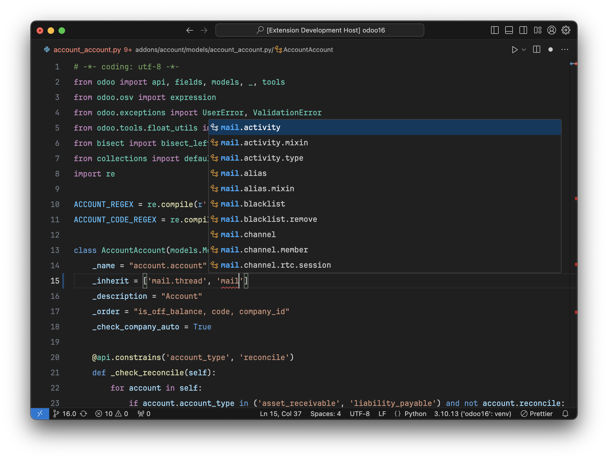
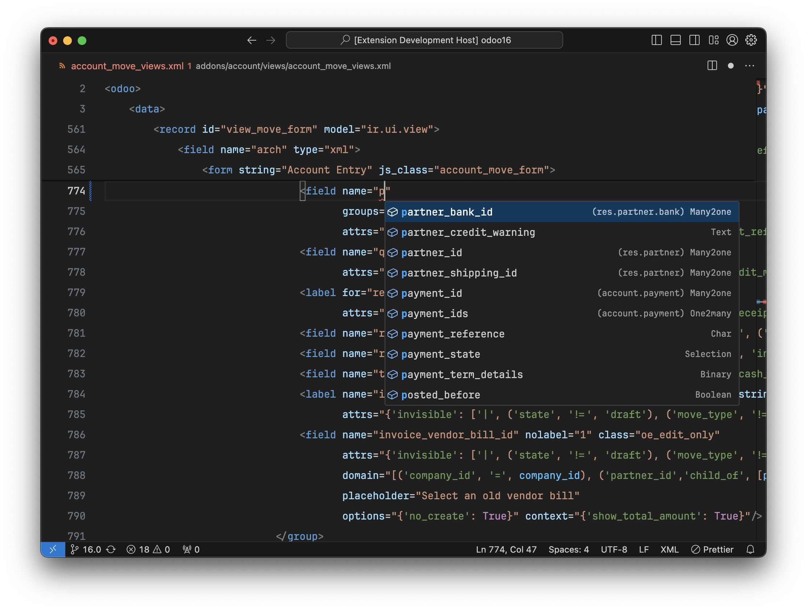

# Odoo Framework Integration for Visual Studio Code

Boost your productivity and make your life easier as an Odoo developer

[Homepage](https://odoo-ide.com) | [Issue Tracker](https://github.com/odoo-ide/vscode-odoo/issues)

This extension is in the early stages of development. A lot of features are missing compared to the [PyCharm plugin for Odoo](https://plugins.jetbrains.com/plugin/13499-odoo-ide).

## Features
- Resolve `odoo.addons.*` imports for built-in addons and custom addons.
- Fully understand model inheritance mechanisms.
- Code completion and navigation for module names, model names, field names, XML IDs,...

## Installation
1. Install the Odoo IDE extension from [VSCode Marketplace](https://marketplace.visualstudio.com/items?itemName=trinhanhngoc.vscode-odoo).
2. Install [PyDev.Debugger plugin for Odoo](https://github.com/odoo-ide/pydevd-odoo) to improve Odoo debugging.

## Notes
- Set the `python.analysis.typeCheckingMode` setting to `basic` or `standard` to enable diagnostics in Python files.
- Depending on how you structure your projects, the Odoo IDE extension may not be able to resolve Odoo symbols. You can manually add the Odoo source code and your custom addons paths to the `python.analysis.extraPaths` setting.
- For a better code completion experience, enable quick suggestion for `strings` in the `editor.quickSuggestions` setting.
- If you use symbolic links, add them to the `files.watcherInclude` setting so the Odoo IDE extension can properly track file changes.
- The Odoo IDE extension is built on top of [Pyright](https://github.com/microsoft/pyright) so it inherits all features of Pyright. If you have the [Pyright extension](https://marketplace.visualstudio.com/items?itemName=ms-pyright.pyright) installed, you should disable it. Otherwise, you will have multiple language servers running with the same features that waste your system resources.

## Screenshots

